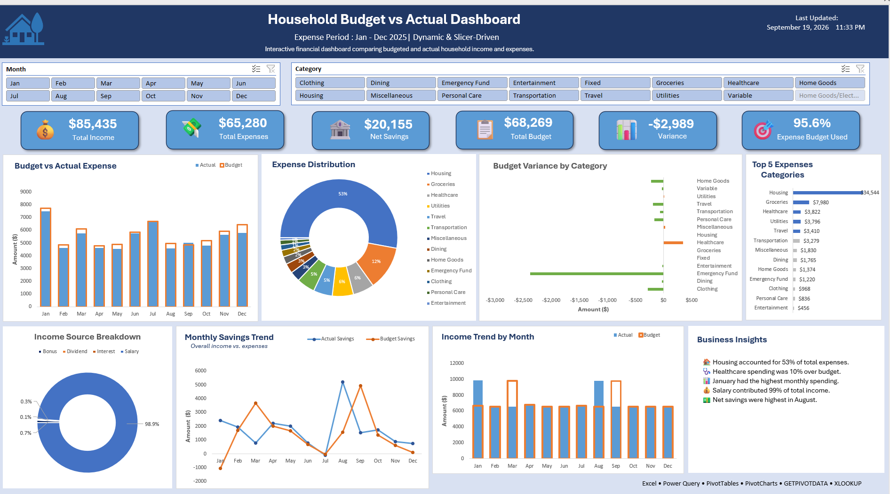

# Household Budget vs Actual Dashboard

## 📊 Project Overview

I built this interactive Excel dashboard to compare **budgeted vs. actual household income and expenses**.

The goal of the project was to turn monthly financial data into a dashboard that makes it easier to see spending patterns, track budget variances, and understand where money is being spent.

This project helped me practice using Excel for data analysis, reporting, and dashboard development.

---

## 📈 What the Dashboard Shows

The dashboard includes:

* Budget vs. actual income and expenses
* Monthly spending trends
* Expense category analysis
* Budget variance analysis
* Payment method analysis
* Key financial KPIs
* Interactive slicers for filtering the dashboard
* Dynamic business insights
* Conditional formatting to highlight important variances
* Last refreshed date

The charts, KPIs, and insights update based on the selections made using the slicers.

---

## 🔎 Key Questions

The dashboard can be used to answer questions such as:

* How much did I actually spend compared with the budget?
* Which expense categories are over or under budget?
* How does spending change from month to month?
* Which categories have the highest expenses?
* Which payment methods are used most often?
* How does actual income compare with the budget?

---

## 🛠️ Tools & Excel Techniques

### Microsoft Excel

* PivotTables
* PivotCharts
* Excel Tables
* Slicers
* GETPIVOTDATA
* Excel formulas
* Conditional formatting
* KPI cards
* Data visualization
* Interactive dashboard design

---

## 📁 Data

I created a realistic household financial dataset containing monthly budget and actual income and expense information.

The data includes categories such as:

* Salary
* Bonus
* Dividend
* Interest
* Housing
* Utilities
* Groceries
* Shopping
* Donations
* Gifts
* Other household expenses

The data was structured to support monthly budget comparisons, spending analysis, and trend analysis.

---

## 📂 Project Structure

```text
household-budget-vs-actual-dashboard/
│
├── README.md
├── Household_Budget_vs_Actual_Dashboard.xlsx
└── household-budget-dashboard.png
```

---

## ▶️ How to Use

1. Download the Excel workbook.
2. Open it in Microsoft Excel.
3. Go to the **Dashboard** sheet.
4. Use the slicers to filter the data.
5. Review the KPIs, charts, and business insights.
6. Clear the slicers to return to the overall view.

> **Note:** Microsoft Excel is recommended to use the interactive features of the dashboard.

---

## 💡 What I Learned

Through this project, I practiced:

* Building an interactive Excel dashboard from structured data
* Creating KPIs and financial metrics
* Comparing budgeted and actual amounts
* Analyzing spending trends and variances
* Using PivotTables and PivotCharts for analysis
* Connecting slicers to different dashboard elements
* Using formulas such as GETPIVOTDATA
* Designing a clean, one-page dashboard
* Presenting data in a way that makes the main insights easy to understand

---

## 💼 Portfolio

This project is part of my data analytics portfolio and represents my work with **Excel and data visualization**.

It is one of my projects demonstrating my progress in building practical data analysis skills.

---

## 🖼️ Dashboard Preview


